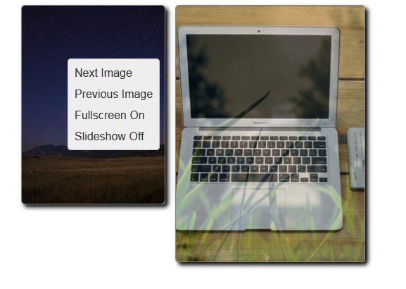

# jsRapPicture
JQuery responsive sideshow plugin with menu and fullscreen mode.

#### Demo

[https://thibor.github.io/jsRapPicture/](https://thibor.github.io/jsRapPicture/) 

### Settings

Option | Type | Default | Description
------ | ---- | ------- | -----------
auto | boolean | false | Enables auto play of slides
pause | int | 3000 | Auto play change interval
transformation | int | 1000 | Transition speed
showDefaultMenu | boolean | true | Show default menu: Next Image, Previous Image, Fullscreen, Slideshow
src | string | '' | web address of the image
customMenu | array of strings| [] | Custom menu

### Events

Event | Params | Description
------ | ---- | -------
onClickMenu | menuItem | Fires after clik menu
onLoad | width, height  | Fires after image is loaded
onNext | next | Fires when next or previous image need load
